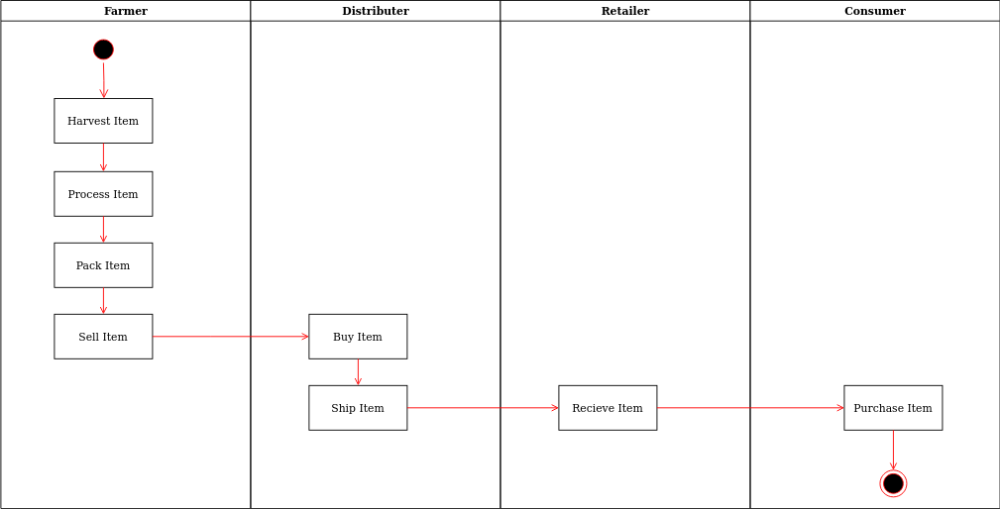

# Udacity Coffee Supply chain

## Enviroment
+ Truffle v5.2.4 (core: 5.2.4)
+ Solidity v0.6.2 (solc-js)
+ Node v15.11.0
+ Web3.js v1.2.9

## Libraries used
+ truffle-assertions V0.9.2
    Used to assert contract events emmited by the contract

## Contract Info
*Address*: [0xa60F40022d72f9faD6551061b38FDe0423151FA7](https://rinkeby.etherscan.io/address/0xa60f40022d72f9fad6551061b38fde0423151fa7)
*Transaction*: [0x87d63e7c2358010ab698239024d19eee7a8780bfe794e234466468ed0e2c9cf2](https://rinkeby.etherscan.io/tx/0x87d63e7c2358010ab698239024d19eee7a8780bfe794e234466468ed0e2c9cf2)

## Project Documents
All project Documents can be found under `/docs` folder

### Activity UML

### Sequence UML

### State UML

### Class UML

